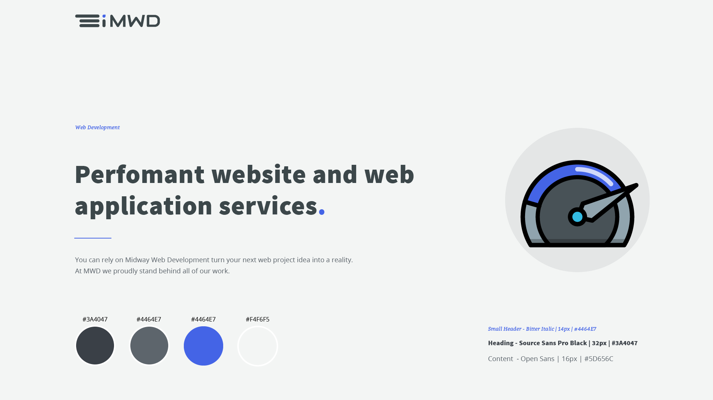
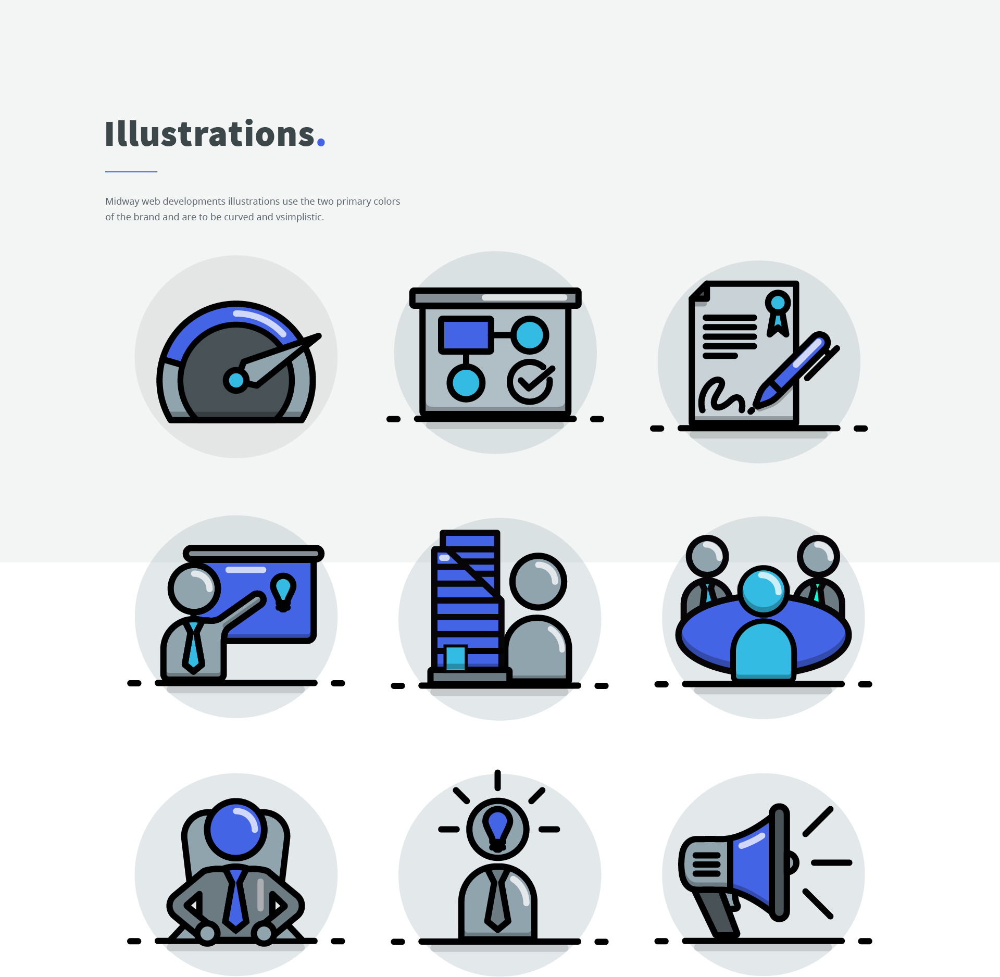

## MWD Style Guide

This is a behind the scenes post to show how we at MWD design a website. The style guide is important in determing a brand, maintiain a design standard, and getting customer input before sending the design off to the development team.

## Whats Included

The style guide will show the logo as well as any variations that can be used through a product. Logos need to be designed to work across a multitude of mediums. Those mediums could be, website headers, mobile application icons, printed products or on large billboards.

Along with logos you will also find the brand color schema. The colors will be listed with their associated color code as well as where the colors should be used.

Next you will find various component designs that will be used on the website. This is to make sure that all of the components combined create an appealing design flow and that they feel like they belong together. The components will sometimes list out dimensions and spacing for the development team to reference.

Lastly and not least is typography. Typograpy is a very critical design decision that will have a large impact on the brand or "feel of you website". The fonts will be laid out with their sizes, associated colors, characteristics and where on the site they will be used.

## Landing Page headers

## Illustrations

## Components

need to add img

## Heading Spacing

need to add img
