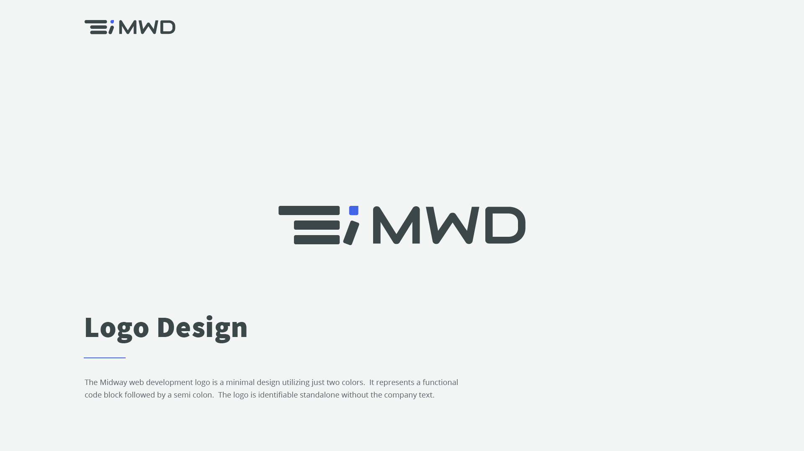
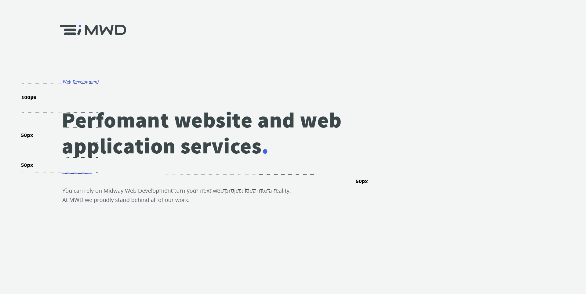
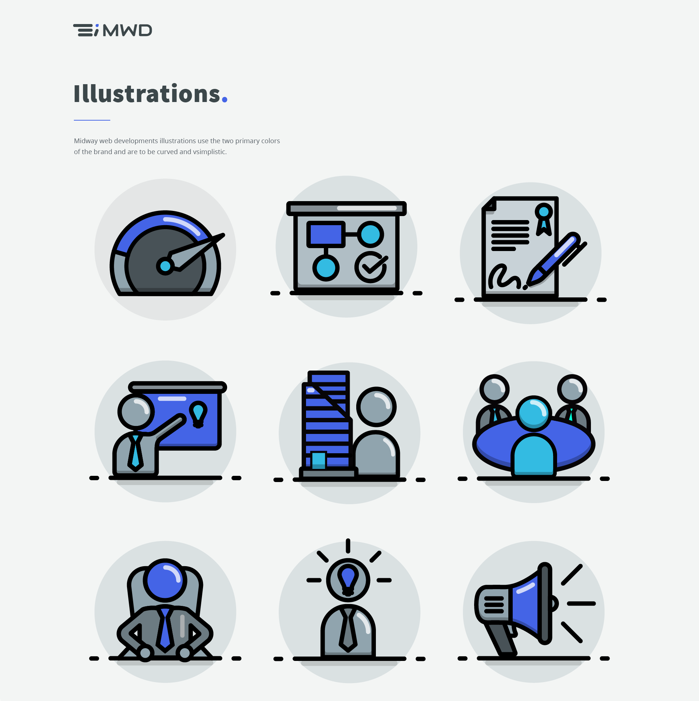
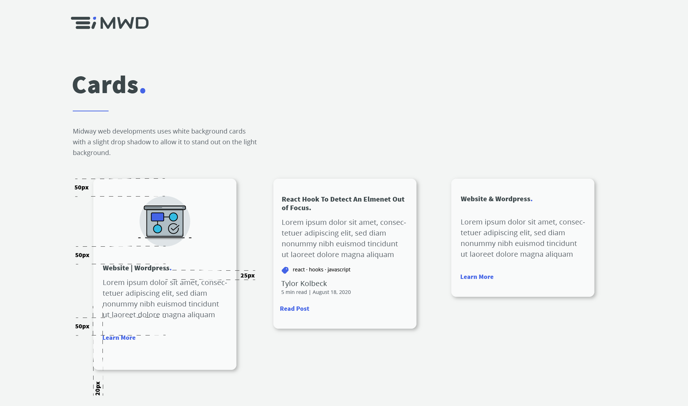

## MWD Style Guide

This is a behind the scenes to show how MWD designs brand and website. The style guide is important in maintaining a design standard, and getting customer input before sending the design off to the front end development team.

## Whats In A Styleguide

One thing and usually the most important is the company logo. The logo will be shown along with its possible variations for different use cases. Logos need to be designed to work across a multitude of mediums which could be, website headers, mobile application icons, printed products or for large billboards.

Along with logos you will also find the brand color schema. The colors will be listed with their associated color code as well as where the colors should be used in the layout.

You will find various component designs that will be used on the website. This is to make sure that all of the components combined create an appealing design flow and that they feel like they belong together. The components will list out dimensions and spacing for the development team to reference.

Lastly and not least is typography. Typograpy is a very critical design decision that will have a large impact on the brand or "feel of you website". The fonts will be laid out with their sizes, associated colors, characteristics and where on the site they will be used. A good thing about having a style guide is you can quickly see if the chosen fonts work with the target brand.

## Midway Web Developments Style Guide

Below you will see a version the the MWD styleguide that was created by the design team.

### Logo Display

### Colors, Font and Sizes

### Measurements Of Main Headings

### Website Illustrations

### Card Components

### Profile Components

